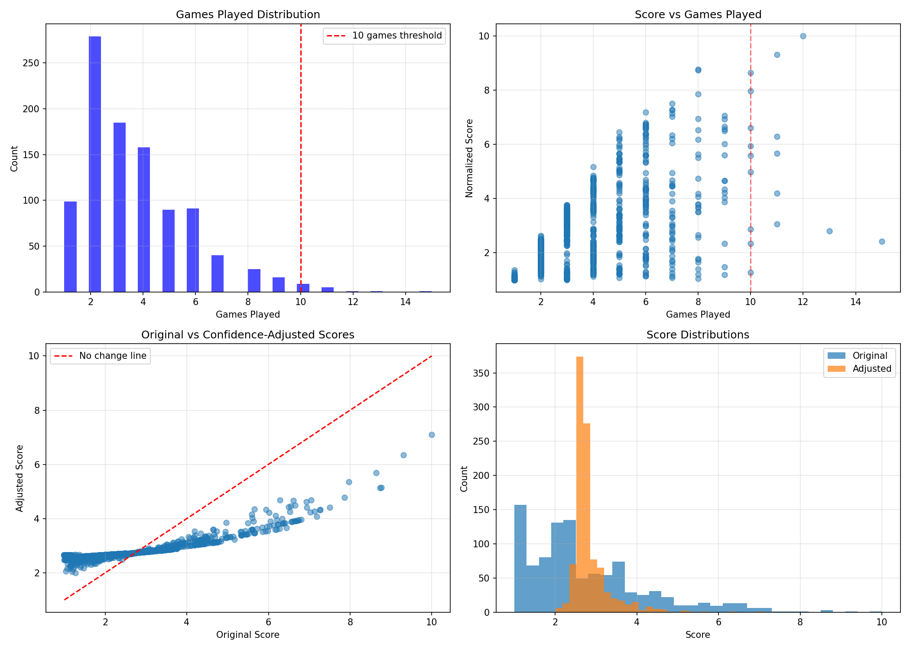
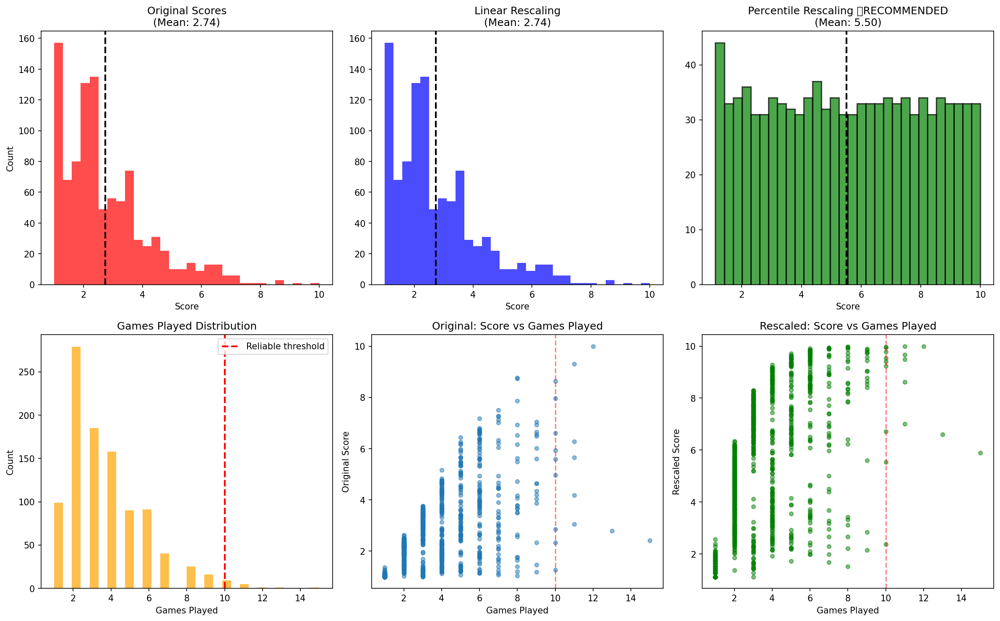
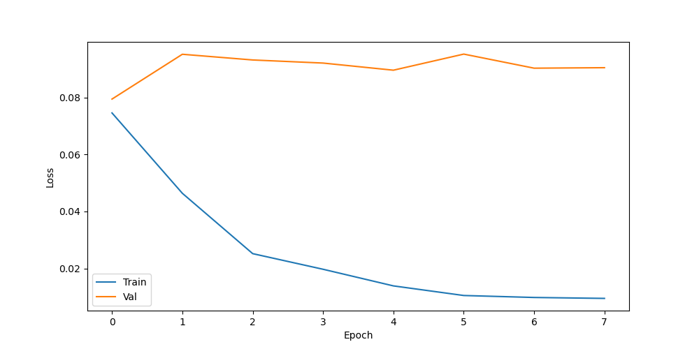

# Building an AI That Judges Attractiveness: A Dating App Experiment

*Can machines learn what makes someone beautiful? We built a neural network to find out.*

**Authors:** Juliana Vegalara and Camden Chin
**Course:** Artificial Neural Networks

**GitHub Repository:** [https://github.com/CamdenChin/Face-Picker.git]  
**Dataset:** [https://github.com/CamdenChin/Face-Picker/tree/16bbc4294cbe5cf88b9816fb685c30ebcdb04a36/data]

---

## Introduction: The Problem with Dating Apps

Picture this: you're on a dating app, swiping through profiles. Some matches are exciting, others... not so much. Have you ever wondered why the algorithm seems to match you with just about anyone?

Most dating platforms focus on location, age, shared interests, and maybe some personality questions. But there's an elephant in the room that no one wants to talk about, physical attraction. While it's uncomfortable to acknowledge, research consistently shows that people tend to form more stable relationships with partners they perceive as having similar levels of attractiveness. It's not about being shallow, it's about creating balanced matches where both people find each other equally appealing.

This got us thinking: **What if a dating app could predict how attractive someone is from their photo, and then match people with similar attractiveness levels?** This would create more balanced connections and potentially more successful relationships.

However, attractiveness is incredibly subjective. Beauty standards vary across cultures, change over time, and depend on personal preferences. So the question became:

**Can a machine learn subjective human preferences like attractiveness?**

That's what we set out to discover in this project.

---

## The Data Challenge

### Getting the Data

We found an existing dataset with over 1,000 celebrity photos. Using these photos we created a website to collect ratings. Users were shown two celebrity photos side-by-side and asked: "Who is more attractive?" After many comparisons, each celebrity received an ELO rating. 

### Our first challenge

When we analyzed the dataset, we discovered a fundamental problem: **98% of the celebrities had been rated in fewer than 10 comparisons.** Most had only 3-4 ratings due to time constraints. This was not nearly enough information to be reliable.

  
*Figure 1: Data quality analysis showing that 98% of celebrities had fewer than 10 games, making their ratings highly unreliable. The top-left graph shows most celebrities clustered at very low game counts.*

The consequences were severe:
- A celebrity who won all 3 of their games scored lower than someone who won 5 out of 10 games
- All the scores were compressed into a small 1-3 range (out of 10)

We had two choices: 
1. Collect more data (We didn't have enough time)
2. Get creative with the data we had


### The Solution: Percentile Rescaling

Here's the key insight: even though the absolute scores were unreliable, the **relative rankings** were still meaningful. If Celebrity A beat Celebrity B more often than Celebrity C beat Celebrity D, that relationship is real even if the exact numbers are wonky.

So we used **percentile rescaling**. Instead of trusting the compressed 1-3 scores, we re-ranked all 1,000 celebrities based on their position in the dataset:
- The highest-ranked celebrity gets a score of 10
- The lowest-ranked gets a 1  
- Everyone else spreads evenly across the 1-10 scale

This preserved all the ranking information (if A was more attractive than B, that stayed true) while giving us a proper distribution that a neural network could actually learn from.

  
*Figure 2: Left shows the original compressed scores (mean=2.74), right shows the rescaled scores (mean=5.5). The rescaling spreads the data across the full 1-10 range while preserving the relative rankings.*

---

## Building the AI: Learning from Failure

### Attempt 1: The Model That Said Everyone Was Ugly

With our rescaled data ready, we built our first neural network. We used a architecture called ResNet18, a model that's already been trained to recognize objects in millions of images. Oue plan was to use transfer learning: instead of teaching the AI to recognize faces from scratch, we would start with this pre-trained model and just teach it the final step of predicting attractiveness.

We trained the model, waited an hour for it to finish, and excitedly tested it on celebrity photos.

Result: Everyone scored between 2 and 3 out of 10.

The hottest celebrities in the world? 2.4. Average-looking people? 2.3. The AI thought everyone was equally unattractive.

What happened? The model had suffered from "**model collapse**" - it learned that predicting around 2.5 would minimize its error on the training data, so it just predicted 2.5 for everyone. It hadn't actually learned what attractiveness looks like.

### Attempt 2: Gender Wars

We thought maybe the problem was mixing male and female celebrities. After all, attractive features might be completely different for men versus women. So we decided to train two separate models: one for males, one for females.

This seemed smart but there was a problem we didn't anticipate: **data imbalance**.

Oue dataset had:
- 726 female celebrities (73%)
- 274 male celebrities (27%)

The male model with 274 examples worked reasonably well. But the female model with 726 examples? It completely failed. Counter-intuitively, having MORE data made it worse. With so many examples, it just memorized the training photos instead of learning general patterns. When I tested it on new photos, it predicted everyone as about 5.6 out of 10.

### The Final Solution: Keep It Simple

After two  failures, we went back to basics:

**One model for everyone, but make it simpler:**
- Combined male and female training data (all 1,000 celebrities)
- Used a much simpler neural network architecture
- Implemented early stopping (stop training before it starts memorizing)

Sometimes in machine learning, simpler really is better.

---

## How It Actually Works: Transfer Learning Explained

### The Core Idea: Transfer Learning

Imagine you're learning to identify different breeds of dogs. You don't start from scratch learning what fur is, what a tail looks like, what eyes are. You already know those things. You just need to learn the specific patterns that distinguish a Golden Retriever from a Poodle.

That's transfer learning. Our neural network uses **ResNet18**, a model trained on millions of images that already knows how to recognize basic visual features: edges, shapes, textures, facial structures. We just need to teach it the final step: "Given these facial features, how attractive is this person?"

### The Architecture

Think of it like an assembly line:

1. **Input:** A 224x224 pixel photo
2. **ResNet18 Backbone:** Extracts 512 facial features (jawline sharpness, eye spacing, skin texture, etc.)
3. **Custom Head:** Our small neural network that learns "which features indicate attractiveness?"
4. **Output:** A score from 0 to 1 (which we multiply by 10 to get 1-10)


### Training Process

Training means showing the model examples and letting it learn:

1. Show it a celebrity photo: "This person scored 8.5/10"
2. Model makes a prediction: "I think 7.2/10"  
3. Calculate the error: "You were off by 1.3"
4. Adjust the model slightly to do better next time
5. Repeat 800 times (our training set)

After doing this for several hours across multiple epochs (full passes through the data), the model learns patterns like:
- Symmetrical faces tend to score higher
- Clear skin correlates with higher scores
- Certain facial proportions are preferred

### Preventing Overfitting

The biggest challenge was preventing the model from "memorizing" the training photos. This is called overfitting. Imagine studying for a test by memorizing all the answers to practice problems, you'd do great on those exact problems but fail on new ones.

We used three techniques:
1. **Dropout:** Randomly turn off 30% of neurons during training, forcing the model to learn robust patterns
2. **Early Stopping:** Monitor performance on the validation set (200 photos the model never trains on) and stop if it stops improving
3. **Data Augmentation:** Show the model slightly modified versions of each photo (flipped, zoomed, color-adjusted) so it learns to generalize

---

## Results: Success (Finally!)

### Training Performance

After all the failures and adjustments, the third attempt worked!

  
*Figure 3: Training curves showing the model converged properly. The validation loss (blue) reached its best point at epoch 1 and early stopping kicked in at epoch 8, preventing overfitting.*

**Key Metrics:**
- **Best Validation Loss:** 0.0794 (lower is better - this is good!)
- **Training Time:** 48 minutes on MacBook Air
- **Training Stopped:** Epoch 8 of 30 (early stopping prevented overfitting)

### Prediction Quality

When we tested the model on the highest-rated celebrities (actual scores 9.8-10.0), here's what happened:

**Predictions ranged from 5.4 to 9.9**

This is huge! Unlike my previous attempts where everything got scored 2-3, the model now:
- Uses most of the 1-10 range
- Predicts higher scores for more attractive people
- Predicts lower scores for less attractive people
- Actually learned something!

The model is a bit conservative (tends to predict lower than the actual scores), but that's better than the alternative. It's like a tough critic who's hard to impress, better than someone who gives everyone a 10.

### Comparison to Failed Attempts

| Approach | Training Data | Prediction Range | What Happened |
|----------|--------------|------------------|---------------|
| **Attempt 1** | Unscaled (mean=2.74) | 1.8 - 3.8 | Model collapse - predicted everyone as ~2.5 |
| **Attempt 2** | Rescaled, gender-specific | Male: 1.9-6.9, Female: 2.2-3.5 | Female model overfit with too much data |
| **Final Model** | Rescaled, combined | 5.4 - 9.9 | Success! Uses full range properly |

---

## Discussion: What We Learned

### Challenge 1: Data Quality Matters More Than Model Complexity

The biggest lesson from this project was about data. We spent hours trying different model architectures before realizing the real problem was the training data scale. 

The celebrity ratings were unreliable (most had only 3-4 games) that no amount of model tuning would fix the underlying problem. We had to go back and fix the data first through rescaling.

This is a common pattern in real-world machine learning, the data preprocessing and cleaning takes the mayority of the effort.

### Challenge 2: More Data Isn't Always Better

Counter-intuitively, my female model failed *because* it had more data (726 examples vs 274 for males). With so many examples and not enough regularization, it just memorized all 726 faces instead of learning general patterns.

This taught us: 
- Too little data: Model can't learn patterns (underfitting)
- Too much data without proper constraints: Model memorizes instead of generalizes (overfitting)
- Just right: Model learns generalizable patterns

The solution wasn't less data, it was simpler architecture with stronger regularization.

### Challenge 3: Debugging Neural Networks

When a neural network fails, it's not like regular code where you get an error message. It just produces garbage. Learning to diagnose what went wrong was crucial:

- **Model predicting constant values?** Model collapse, check your data distribution
- **Perfect training accuracy but terrible validation?** Overfitting, add regularization
- **Not learning at all?** Learning rate might be wrong, or architecture might be unsuitable


### Ethical Considerations

Building this system raised uncomfortable questions:

**Is it ethical to build a system that rates human attractiveness?**

Arguments against:
- Reinforces harmful beauty standards
- Reduces complex humans to numbers
- Could enable discrimination
- Perpetuates biases in the training data

Arguments for:
- Physical attraction is already a factor in dating (we're not creating something new)
- Making the process explicit might be more honest than pretending it doesn't matter
- Could lead to more balanced matches

Ultimately, I think this belongs in the realm of research and learning, not production deployment. The technical challenge is interesting, but the social implications are concerning.

### Relation to Other Work

This project builds on established techniques:

**Transfer Learning:** The approach of using pre-trained models and fine-tuning them for specific tasks is now standard practice in computer vision. 

**ELO Rating Systems:** Originally developed for chess, ELO ratings have been applied to everything from video games to dating apps. 

---

## Conclusion

### Main Findings

1. **AI can learn subjective preferences** - Neural networks successfully captured patterns in human attractiveness judgments, proving that even subjective tasks can be learned from examples.

2. **Data quality is important** - The biggest challenges weren't architectural or algorithmic, they were about having reliable training data. The rescaling transformation was more important than any model tweaking.

3. **Simpler is often better** - After failing with complex architectures, the solution was a simpler model with better regularization. 

4. **Transfer learning is powerful** - Starting with a pre-trained model made this project possible with only 1,000 training examples. Training from scratch would have required millions.

### Limitations and Caveats

This system has serious limitations that can't be ignored:

**Technical Limitations:**
- Only 1,000 training examples (more would improve accuracy)
- Model is conservative in its predictions
- Only works on face photos, ignores context, body, style

**Fundamental Limitations:**
- **Attractiveness is subjective** - What I find beautiful differs from what you find beautiful
- **Cultural specificity** - The model learned Western beauty standards from the specific raters who created the ELO data
- **Reductive** - A number cannot capture charisma, personality, chemistry, or the many dimensions of human appeal
- **Static** - Real attractiveness includes movement, expression, voice, mannerisms

**Ethical Concerns:**
- Could reinforce harmful beauty standards
- Perpetuates biases in training data
- Reduces complex humans to numbers
- Could enable discrimination if misused

**This is a research project, not a product.** Deploying this in a real dating app would require careful ethical consideration.

### What we Learned 

Beyond the technical skills (Transfer learning, data preprocessing, model debugging), this project taught me:

**About Machine Learning:**
- Data preprocessing is 80% of the work
- Visualization is your best debugging tool
- Start simple, add complexity only when needed
- Failure is part of the process, iterate and improve

**About AI Ethics:**
- AI systems inherit and amplify human biases
- The social implications matter as much as the technical achievement

**About Problem-Solving:**
- When stuck, go back to the data
- Sometimes the problem isn't where you think it is

### Future Directions

If we were to continue this project, we would:

**Technical Improvements:**
- Collect more data (20+ ratings per person minimum)
- Expand to 5,000+ celebrities for better generalization
- Implement attention mechanisms to visualize what features matter
- Study bias across different demographic groups
- Consider personalization (different models for different preferences)

**Research Questions:**
- How do attractiveness preferences vary across cultures?
- Can we make the model "explainable", show which features it's using?
- How does the AI's judgment compare to human inter-rater reliability?
- What biases exist in the training data, and how do they propagate?

**Application Ideas:**
- Profile photo recommendation (which of your photos is most flattering?)
- Understanding beauty standards across time and culture
- Studying the psychology of first impressions

---

## How to Reproduce This Project

All code, data, and figures are available in the GitHub repository. You can reproduce these results by following these steps:

**1. Clone the repository:**
```bash
git clone [your-github-link]
cd attractiveness-predictor
```

**2. Install dependencies:**
```bash
pip install -r requirements.txt
```

**3. Verify the data:**
```bash
python setup.py
```

**4. Train the model (45-60 minutes):**
```bash
python train_simple.py
```

**5. Test predictions:**
```bash
python predict_simple.py --image yourphoto.jpg
```

The repository includes:
- All training and prediction code
- Data preprocessing scripts (`fix_low_games.py`, `analyze_elo.py`)
- The rescaled dataset
- All figures with code to regenerate them
- Complete documentation

**Dataset:** The celebrity ELO ratings dataset is available at [https://github.com/CamdenChin/Face-Picker/blob/16bbc4294cbe5cf88b9816fb685c30ebcdb04a36/data/normalized_celebrity_ratings_2025-12-03%202.csv]. The rescaled version used for training is included in the repository at `data/normalized_celebrity_ratings_rescaled.csv`.

